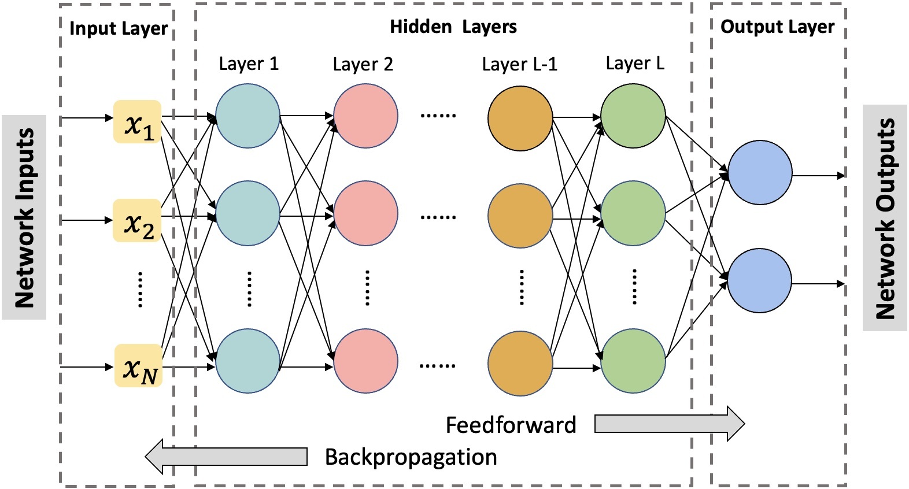

[American Option Pricing using Self-Attention GRU and Shapley Value Interpretation](https://arxiv.org/pdf/2310.12500.pdf)
* Construct four different machine learning models, including multilayer perceptron (MLP), long short-term memory (LSTM), self-attention LSTM, and self-attention gated recurrent unit (GRU) in comparison to the traditional binomial model.
* The results show that the self-attention GRU model with historical data outperforms other models due to its ability to capture complex temporal dependencies embedded in the historical data.
* Employ the SHapley Additive exPlanations (SHAP) method to interpret and analyze the prediction results of the self-attention GRU model with historical data, which provides insights that the current spot price, strike, and moneyness have the greatest impacts on predicting the current SPY call price.

  

{width=50}  
